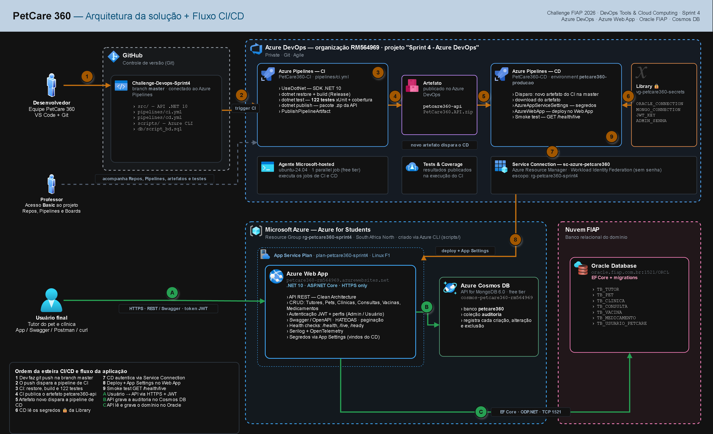

# PetCare 360 — CI/CD com Azure DevOps

Entrega da **4ª Sprint** da disciplina **DevOps Tools & Cloud Computing** — Challenge FIAP 2026, em parceria com a **CLYVO VET**.

Nesta sprint a API .NET do PetCare 360 ganhou uma **esteira completa de CI/CD no Azure DevOps**. Todo commit na branch `master` compila a solução, roda os 122 testes automatizados, gera um artefato versionado e, sem ninguém clicar em nada, publica a nova versão no **Azure Web App**. A API conversa com dois bancos em nuvem: o **Oracle da FIAP**, que guarda o domínio veterinário, e o **Azure Cosmos DB for MongoDB**, que guarda a auditoria.

> **Aplicação no ar:**
> - Swagger: `https://petcare360-rm564969.azurewebsites.net/swagger`
> - Health check: `https://petcare360-rm564969.azurewebsites.net/health`
>
> **Projeto no Azure DevOps:** `https://dev.azure.com/RM564969/Sprint%204%20-%20Azure%20DevOps`

---

## Sumário

- [Integrantes](#integrantes)
- [Descrição da solução](#descrição-da-solução)
- [Stack de tecnologias](#stack-de-tecnologias)
- [Arquitetura e fluxo CI/CD](#arquitetura-e-fluxo-cicd)
- [Banco de dados em nuvem](#banco-de-dados-em-nuvem)
- [Projeto no Azure DevOps](#projeto-no-azure-devops)
- [Pipeline de CI](#pipeline-de-ci)
- [Pipeline de CD](#pipeline-de-cd)
- [Regras da pipeline atendidas](#regras-da-pipeline-atendidas)
- [Variáveis de ambiente protegidas](#variáveis-de-ambiente-protegidas)
- [Infraestrutura via Azure CLI](#infraestrutura-via-azure-cli)
- [Como reproduzir do zero (How To)](#como-reproduzir-do-zero-how-to)
- [Testando a aplicação na nuvem (CRUD + SELECT)](#testando-a-aplicação-na-nuvem-crud--select)
- [Testes automatizados](#testes-automatizados)
- [Estrutura do repositório](#estrutura-do-repositório)
- [Rodando localmente (opcional)](#rodando-localmente-opcional)
- [Problemas que enfrentamos e como resolvemos](#problemas-que-enfrentamos-e-como-resolvemos)
- [Removendo os recursos](#removendo-os-recursos)

---

## Integrantes

**Turma 2TDSPW** — Análise e Desenvolvimento de Sistemas

| Nome completo | RM | Turma |
|---|---|---|
| Murillo Fernandes Carapia | RM564969 | 2TDSPW |
| Kauan Vieira de Lima | RM565403 | 2TDSPW |
| João Vitor Lacerda | RM565565 | 2TDSPW |
| Pedro de Matos Previtali | RM564184 | 2TDSPW |

---

## Descrição da solução

O **PetCare 360** nasceu de um problema que todo dono de pet conhece: a saúde do animal vive aos pedaços. O tutor perde a carteirinha de vacinação, esquece quando foi a última dose, troca de clínica e o histórico fica pra trás. Cada clínica tem seu sistema, cada veterinário anota do seu jeito, e quem paga o preço é o animal.

A nossa API centraliza **tutor, pet, clínica, consultas, vacinas e medicamentos** num lugar só. Ela é o núcleo de cadastro do projeto: antes de qualquer informação chegar ao app do tutor ou ao painel da clínica, ela passa por aqui.

O que a aplicação entrega:

- **CRUD completo de 6 entidades** relacionadas, com rotas extras como o histórico clínico completo de um pet
- **Login com JWT** e perfis de acesso (**Admin** e **Usuario**), com senhas guardadas em hash PBKDF2
- **Auditoria** de toda criação, alteração e exclusão, gravada no Cosmos DB (API do MongoDB)
- **Paginação, filtros e HATEOAS** nas listagens
- **Health checks** que conferem o Oracle, o MongoDB e as migrations
- **Logs estruturados** com Serilog e **tracing/métricas** com OpenTelemetry

**O foco desta entrega** não é a regra de negócio (essa foi construída em Advanced Business Development with .NET), e sim o **ciclo de entrega contínua**:

- Repositório Git no GitHub conectado ao **Azure Pipelines**
- **CI** disparada a cada push na `master`: build, **122 testes automatizados**, cobertura de código e **publicação do artefato**
- **CD** disparada automaticamente quando um **novo artefato** é gerado: configura os segredos e faz o **deploy no Azure Web App**
- **Credenciais protegidas** num Variable Group com valores secretos, sem nenhuma senha no código ou no YAML
- Infraestrutura criada por **Azure CLI**, versionada em `scripts/`

### Benefícios para o negócio

**Para o tutor e para a clínica.** O histórico do pet fica disponível na nuvem, de qualquer lugar, mesmo se o tutor trocar de clínica. Menos vacina vencida sem aviso e menos risco de prescrever algo que conflita com uma medicação em uso.

**Para a CLYVO VET.** Uma base centralizada abre caminho pra uma rede de clínicas parceiras e pra inteligência de mercado: sazonalidade de atendimentos, cobertura vacinal por região, padrões de doença.

**Para o time de desenvolvimento (foco da disciplina).**

- **Entrega em minutos, sem passo manual.** Do `git push` à versão nova no ar, sem ninguém abrir o portal ou copiar arquivo.
- **Nada quebrado chega em produção.** Se um único teste falhar, a CI fica vermelha, o artefato não é gerado e o CD nem começa.
- **Rastreabilidade.** Cada versão publicada aponta pro commit, pra execução da CI e pro artefato que a geraram.
- **Segurança.** Senhas e chaves ficam só no Azure DevOps, mascaradas nos logs. O repositório pode ser aberto pra qualquer pessoa sem expor nada.
- **Ambiente reprodutível.** Os scripts de infraestrutura e as pipelines estão versionados: qualquer integrante recria tudo do zero seguindo este README.

---

## Stack de tecnologias

| Camada | Tecnologia |
|---|---|
| Aplicação | .NET 10, ASP.NET Core Web API, Clean Architecture |
| Persistência relacional | Entity Framework Core 10 + Oracle (provider `Oracle.EntityFrameworkCore`) |
| Persistência NoSQL | MongoDB.Driver → Azure Cosmos DB for MongoDB 6.0 |
| Segurança | JWT Bearer, PBKDF2-SHA256 |
| Documentação | Swagger / OpenAPI |
| Observabilidade | Serilog, OpenTelemetry, Health Checks |
| Testes | xUnit, Moq, WebApplicationFactory, EF Core InMemory, Coverlet |
| Controle de versão | Git + GitHub (branch `master`) |
| CI/CD | **Azure DevOps** — Azure Pipelines (YAML), Pipeline Artifacts, Library, Environments |
| Nuvem da aplicação | **Azure Web App** (App Service Linux, plano F1) |
| Bancos em nuvem | **Oracle Database da FIAP** + **Azure Cosmos DB** |
| Infraestrutura | Azure CLI (scripts versionados) |

---

## Arquitetura e fluxo CI/CD



> O arquivo editável do diagrama está em [`docs/arquitetura.drawio`](docs/arquitetura.drawio) (abre no [draw.io](https://app.diagrams.net)).

### Esteira de CI/CD (passos 1 a 9)

1. O **desenvolvedor** faz `git push` na branch `master` do GitHub.
2. O push **dispara automaticamente** a pipeline **PetCare360-CI** no Azure Pipelines.
3. A CI roda num agente Microsoft-hosted (`ubuntu-24.04`): restaura os pacotes, compila em Release e executa os **122 testes** com cobertura de código.
4. Com tudo verde, a CI gera o pacote da API (`dotnet publish`) e **publica o artefato** `petcare360-api` no Azure DevOps.
5. O artefato novo **dispara automaticamente** a pipeline **PetCare360-CD**.
6. A CD lê as credenciais protegidas do Variable Group **`vg-petcare360-secrets`** (Library).
7. A CD se autentica na Azure pela Service Connection **`sc-azure-petcare360`** (Workload Identity Federation, sem senha).
8. A CD grava os segredos como **App Settings** do Web App e faz o **deploy** do pacote.
9. Um **smoke test** chama `GET /health/live` até a API responder `200`, provando que a versão nova subiu.

### Fluxo da aplicação em produção (A, B e C)

- **A.** O usuário final (tutor, clínica, Swagger ou Postman) chama a API por **HTTPS**, com o token **JWT** no header.
- **B.** A cada criação, alteração ou exclusão, a API grava um registro de **auditoria** no **Cosmos DB**.
- **C.** Os dados do domínio são lidos e gravados no **Oracle da FIAP** via Entity Framework Core.

### Personas

| Persona | Onde atua |
|---|---|
| **Desenvolvedor** | Escreve o código no VS Code e faz push no GitHub. Acompanha as execuções no Azure DevOps. |
| **Professor** | Acessa o projeto no Azure DevOps com nível **Basic**: Repos, Pipelines, artefatos, testes e Boards. |
| **Usuário final** | Tutor do pet e clínica veterinária, consumindo a API pelo app ou pelo Swagger. |

---

## Banco de dados em nuvem

O projeto usa **dois bancos em nuvem**, cada um com um papel claro.

### Oracle Database da FIAP — domínio veterinário

Banco relacional principal (`oracle.fiap.com.br:1521/ORCL`), aceito na lista do enunciado como "Oracle da FIAP". As tabelas são criadas pelas **migrations do Entity Framework Core** e o DDL completo, com comentários em todas as tabelas e colunas, está em [`db/script_bd.sql`](db/script_bd.sql).

| Tabela | Conteúdo |
|---|---|
| `TB_TUTOR` | Tutores responsáveis pelos pets |
| `TB_PET` | Animais, ligados a um tutor |
| `TB_CLINICA` | Clínicas veterinárias da rede |
| `TB_CONSULTA` | Atendimentos (pet + clínica) |
| `TB_VACINA` | Vacinas aplicadas |
| `TB_MEDICAMENTO` | Medicamentos prescritos |
| `TB_USUARIO_PETCARE` | Usuários da API (login JWT) |

```
TB_TUTOR (1) ──────┐
                   │ N
                   ▼
TB_PET (1) ──┬──→ TB_CONSULTA (N) ←── (1) TB_CLINICA
             │           │
             ├──→ TB_VACINA (N)
             │
             └──→ TB_MEDICAMENTO (N)

TB_USUARIO_PETCARE   (independente, usada no login)
```

### Azure Cosmos DB for MongoDB — auditoria

Conta `cosmos-petcare360-rm564969`, com API do MongoDB **6.0** e **free tier**. Guarda a coleção `auditoria` do banco `petcare360`: um documento por operação, com entidade, id, ação, descrição e data/hora. A coleção tem índice em `DataHora`, que é usado na ordenação da rota `GET /api/Auditoria`.

---

## Projeto no Azure DevOps

| Item | Configuração |
|---|---|
| Organização | `RM564969` |
| Project name | `Sprint 4 - Azure DevOps` |
| Description | Projeto para entrega da Sprint 4 do professor Antonio Sergio Rodrigues Figueiredo + integrantes (RM - nome - turma) |
| Visibility | **Private** |
| Version control | **Git** |
| Work item process | **Agile** |
| Acesso do professor | Convidado com nível **Basic** e incluído em **Project Administrators** |
| Paralelismo | Free tier: 1 parallel job Microsoft-hosted para projetos privados |

Recursos usados dentro do projeto:

| Recurso | Nome | Onde ver |
|---|---|---|
| Pipeline de CI | `PetCare360-CI` | Pipelines → Pipelines |
| Pipeline de CD | `PetCare360-CD` | Pipelines → Pipelines |
| Environment | `petcare360-producao` | Pipelines → Environments |
| Variable Group | `vg-petcare360-secrets` | Pipelines → Library |
| Service Connection | `sc-azure-petcare360` | Project settings → Service connections |
| Conexão com o GitHub | App Azure Pipelines | Project settings → GitHub connections |

---

## Pipeline de CI

Arquivo: [`pipelines/ci.yml`](pipelines/ci.yml) · Pipeline: **PetCare360-CI**

**Gatilho:** qualquer push na branch `master`.

```yaml
trigger:
  branches:
    include:
      - master
```

| # | Etapa | O que faz |
|---|---|---|
| 1 | Instalar o SDK do .NET 10 | `UseDotNet@2` garante a mesma versão do .NET usada no desenvolvimento |
| 2 | Restaurar dependências (NuGet) | `dotnet restore` da solução `src/PetCare360.API.slnx` |
| 3 | Compilar a solução | `dotnet build` em **Release**, sem restaurar de novo |
| 4 | Executar testes unitários e de integração | `dotnet test` com coleta de cobertura (`XPlat Code Coverage`). Os resultados aparecem na aba **Tests** |
| 5 | Publicar a cobertura de código | `PublishCodeCoverageResults@2` — aba **Code Coverage** |
| 6 | Gerar o pacote da API | `dotnet publish` do projeto da API, compactado em `.zip` |
| 7 | Publicar o artefato no Azure DevOps | `PublishPipelineArtifact@1` com o nome **`petcare360-api`** |

Se qualquer etapa falhar, inclusive um único teste, a execução fica vermelha e **nenhum artefato é publicado**. Assim o CD não roda.

---

## Pipeline de CD

Arquivo: [`pipelines/cd.yml`](pipelines/cd.yml) · Pipeline: **PetCare360-CD**

**Gatilho:** conclusão de uma execução da CI na `master`, ou seja, um **novo artefato gerado**. O CD não tem gatilho de commit (`trigger: none`); ele só reage ao CI.

```yaml
resources:
  pipelines:
    - pipeline: ci
      source: PetCare360-CI
      trigger:
        branches:
          include:
            - master
```

O deploy roda como um **deployment job** no Environment `petcare360-producao`, o que deixa o histórico de versões publicadas visível em Pipelines → Environments.

| # | Etapa | O que faz |
|---|---|---|
| 1 | Baixar o artefato gerado pelo CI | `download: ci` — pega exatamente o pacote que passou nos testes |
| 2 | Configurar as variáveis de ambiente protegidas | `AzureAppServiceSettings@1` grava os segredos do Variable Group como App Settings do Web App |
| 3 | Publicar a API no Azure Web App | `AzureWebApp@1` faz o deploy do `.zip` no Web App Linux com runtime .NET 10 |
| 4 | Validar a API publicada (smoke test) | Chama `GET /health/live` até 20 vezes; só fica verde quando a API responde `200` |

---

## Regras da pipeline atendidas

| Regra do enunciado | Como foi atendida |
|---|---|
| I. Configurada e conectada ao repositório | Pipelines YAML no repositório do GitHub, conectado pelo app Azure Pipelines |
| II. CI dispara a cada alteração na `master` | `trigger.branches.include: master` no `ci.yml` |
| III. CD dispara após novo artefato gerado | `resources.pipelines` com `trigger` apontando pro `PetCare360-CI` no `cd.yml` |
| IV. Variáveis sensíveis protegidas | Variable Group `vg-petcare360-secrets` com os 4 valores marcados como **secret** 🔒 |
| V. Geração e publicação do artefato | `dotnet publish` + `PublishPipelineArtifact` → artefato `petcare360-api` |
| VI. Etapa de execução de testes | `dotnet test` com **122 testes** (87 unitários + 35 de integração) e cobertura |
| VII. Deploy em Azure Web App ou ACI | `AzureWebApp@1` → **Azure Web App** `petcare360-rm564969` |

---

## Variáveis de ambiente protegidas

**Nenhuma credencial está no código, no `appsettings.json` ou nos arquivos YAML.** O `appsettings.json` versionado tem os campos sensíveis vazios.

As credenciais ficam no Variable Group **`vg-petcare360-secrets`** (Pipelines → Library), todas com o cadeado 🔒 fechado:

| Variável | Uso na aplicação |
|---|---|
| `ORACLE_CONNECTION` | `ConnectionStrings__OracleConnection` — usuário e senha do Oracle da FIAP |
| `MONGO_CONNECTION` | `MongoDbSettings__ConnectionString` — chave de acesso do Cosmos DB |
| `JWT_KEY` | `Jwt__Key` — chave de assinatura dos tokens JWT |
| `ADMIN_SENHA` | `AdminPadrao__Senha` — senha do administrador criado na primeira subida |

Como isso protege os dados:

- **Mascaramento nos logs.** O Azure DevOps troca qualquer valor secreto por `***` nas saídas das execuções.
- **Permissão explícita.** O Variable Group só pode ser usado por pipelines autorizadas. Na primeira execução do CD o acesso foi liberado manualmente (Permit).
- **Service Connection sem senha.** A conexão com a Azure usa **Workload Identity Federation**: não existe client secret pra vazar ou expirar.
- **Testes isolados.** Os testes de integração usam uma chave e uma senha falsas, definidas só dentro do `ApiFactoryFixture`, com banco InMemory.
- **Desenvolvimento local** usa o **User Secrets** do .NET, guardado fora da pasta do projeto.

---

## Infraestrutura via Azure CLI

Todos os recursos da Azure foram criados por linha de comando, com scripts versionados em `scripts/`. Os nomes ficam centralizados em `scripts/00-variaveis.sh`.

| Recurso | Nome | Script |
|---|---|---|
| Resource Group | `rg-petcare360-sprint4` (South Africa North) | `01-criar-webapp.sh` |
| App Service Plan | `plan-petcare360-sprint4` — Linux, **F1 gratuito** | `01-criar-webapp.sh` |
| Web App | `petcare360-rm564969` — runtime **.NET 10**, HTTPS only | `01-criar-webapp.sh` |
| Cosmos DB for MongoDB | `cosmos-petcare360-rm564969` — **6.0**, free tier | `02-criar-cosmosdb.sh` |
| Banco + coleção | `petcare360` / `auditoria` com índice em `DataHora` | `02-criar-cosmosdb.sh` |
| Remoção de tudo | Resource Group inteiro | `99-limpar-tudo.sh` |

A região **South Africa North** foi escolhida porque a assinatura **Azure for Students** da FIAP só libera cinco regiões (`chilecentral`, `southafricanorth`, `southcentralus`, `centralus`, `canadacentral`), e é a mesma região usada na Sprint 3.

---

## Como reproduzir do zero (How To)

### Pré-requisitos

| Ferramenta | Verificação |
|---|---|
| Git | `git --version` |
| .NET SDK 10 | `dotnet --list-sdks` |
| Azure CLI | `az --version` |
| Git Bash (pra rodar os scripts `.sh`) | já vem com o Git for Windows |
| Assinatura Azure ativa | `az login` |
| Organização no Azure DevOps | `https://dev.azure.com` |

### 1. Clonar o repositório

```bash
git clone https://github.com/MurilloFernandesCarapia/Challenge-Devops-Sprint4.git
cd Challenge-Devops-Sprint4
```

### 2. Criar a infraestrutura na Azure (Git Bash)

```bash
az login
az provider register --namespace Microsoft.Web
az provider register --namespace Microsoft.DocumentDB
bash scripts/01-criar-webapp.sh
bash scripts/02-criar-cosmosdb.sh
```

Depois confira a versão do Cosmos DB:

```bash
az cosmosdb show --name cosmos-petcare360-rm564969 --resource-group rg-petcare360-sprint4 --query "apiProperties.serverVersion" -o tsv
```

Se aparecer `3.6`, atualize pelo portal em **Cosmos DB → Settings → Features → Update MongoDB server version → 6.0** (veja [Problemas que enfrentamos](#problemas-que-enfrentamos-e-como-resolvemos)).

### 3. Preparar o banco Oracle

As tabelas são criadas pelas migrations do EF Core. Com a connection string do seu usuário no User Secrets (ver [Rodando localmente](#rodando-localmente-opcional)):

```bash
dotnet tool install --global dotnet-ef
dotnet ef database update --project src/PetCare360.Infrastructure --startup-project src/PetCare360.API
```

O DDL equivalente, comentado, está em `db/script_bd.sql`.

### 4. Configurar o Azure DevOps

1. Criar o projeto **Sprint 4 - Azure DevOps** (Private, Git, Agile).
2. **Project settings → Service connections → New → Azure Resource Manager** com App registration (automatic), Workload identity federation, escopo no Resource Group `rg-petcare360-sprint4`. Nome: **`sc-azure-petcare360`**, com acesso liberado a todas as pipelines.
3. **Pipelines → Library → + Variable group** `vg-petcare360-secrets` com `ORACLE_CONNECTION`, `MONGO_CONNECTION`, `JWT_KEY` e `ADMIN_SENHA`, todas como secret 🔒.

A connection string do Cosmos DB sai deste comando:

```bash
az cosmosdb keys list --type connection-strings --name cosmos-petcare360-rm564969 --resource-group rg-petcare360-sprint4 --query "connectionStrings[0].connectionString" -o tsv
```

### 5. Criar as pipelines

1. **Pipelines → New pipeline → GitHub → Challenge-Devops-Sprint4 → Existing Azure Pipelines YAML file → `/pipelines/ci.yml`**. Rode e renomeie para **`PetCare360-CI`**.
2. Repita com **`/pipelines/cd.yml`**, salve e renomeie para **`PetCare360-CD`**.
3. Rode o CD uma vez manualmente e clique em **Permit** pro Environment e pro Variable Group.

### 6. Ver a esteira funcionando

Qualquer push na `master` agora dispara **CI → artefato → CD → deploy** sozinho:

```bash
git commit -am "Minha alteração"
git push
```

---

## Testando a aplicação na nuvem (CRUD + SELECT)

### 1. Conferir a saúde da aplicação

```
https://petcare360-rm564969.azurewebsites.net/health
```

Resposta esperada: `"status": "Healthy"`, com `oracle-database`, `mongodb` e `migrations` todos **Healthy**.

### 2. Fazer login — `POST /api/Auth/login`

No Swagger (`/swagger`):

```json
{
  "email": "admin@petcare360.com",
  "senha": "<senha definida em ADMIN_SENHA>"
}
```

Copie o `token`, clique em **Authorize** 🔓 e cole só o token. Sem isso, as rotas abaixo voltam `401`.

### 3. CRUD de Tutor com evidência no Oracle

Pra cada operação na API, rode o SELECT no SQL Developer, conectado ao Oracle da FIAP:

```sql
SELECT ID_TUTOR, NM_TUTOR, CPF, EMAIL, TELEFONE, ENDERECO
FROM TB_TUTOR
WHERE CPF = '360.360.360-36';
```

**Inserir — `POST /api/Tutores`**

```json
{
  "nmTutor": "Tutor Demonstração Sprint 4",
  "cpf": "360.360.360-36",
  "email": "demo.sprint4@petcare360.com",
  "telefone": "(11) 98888-3600",
  "endereco": "Av. Paulista, 1106 - Bela Vista, São Paulo/SP"
}
```

Resposta `201 Created`. O SELECT passa a mostrar o registro. Anote o `idTutor` retornado.

**Consultar — `GET /api/Tutores/{id}`**

Resposta `200 OK` com o tutor e os links HATEOAS. O SELECT mostra o mesmo registro.

**Atualizar — `PUT /api/Tutores/{id}`**

```json
{
  "idTutor": 0,
  "nmTutor": "Tutor Demonstração Sprint 4 - Atualizado",
  "cpf": "360.360.360-36",
  "email": "demo.sprint4@petcare360.com",
  "telefone": "(11) 97777-3600",
  "endereco": "Av. Paulista, 1106 - Bela Vista, São Paulo/SP"
}
```

Troque o `0` pelo `idTutor` real. Resposta `204 No Content`. O SELECT mostra o nome e o telefone novos.

**Deletar — `DELETE /api/Tutores/{id}`** (exige perfil Admin)

Resposta `204 No Content`. O SELECT volta **sem linhas**.

### 4. Auditoria no Cosmos DB

As três operações de escrita geram registros de auditoria. Pra ver:

- pela API: `GET /api/Auditoria/Tutor/{id}`
- pelo portal: **Cosmos DB → Data Explorer → petcare360 → auditoria → Documents**

---

## Testes automatizados

São **122 testes** rodando na CI a cada commit:

| Projeto | Quantidade | O que cobre |
|---|---|---|
| `PetCare360.UnitTests` | 87 | Services (regras de negócio), JWT, hash de senha, HATEOAS, paginação, tratamento global de erros |
| `PetCare360.IntegrationTests` | 35 | API completa em memória (WebApplicationFactory + EF Core InMemory): autenticação, autorização, CRUD, paginação, HATEOAS, auditoria e health checks |

A cobertura de linhas nas camadas de Domínio e Aplicação é de **92,1%**. Os testes não dependem de banco real: o Oracle é substituído pelo InMemory e o MongoDB por um repositório fake, então rodam iguais no PC e no agente da pipeline.

Pra rodar localmente:

```bash
dotnet test src/PetCare360.API.slnx
```

---

## Estrutura do repositório

```
Challenge-Devops-Sprint4/
├── src/                                   # Solution .NET 10 (Clean Architecture)
│   ├── PetCare360.API/                    # Controllers, Program.cs, JWT, Swagger, HATEOAS
│   ├── PetCare360.Application/            # Services (regras de negócio)
│   ├── PetCare360.Domain/                 # Entidades, DTOs, interfaces
│   ├── PetCare360.Infrastructure/         # EF Core (Oracle), MongoDB, repositórios, migrations
│   ├── PetCare360.UnitTests/              # 87 testes unitários
│   ├── PetCare360.IntegrationTests/       # 35 testes de integração
│   └── PetCare360.API.slnx
├── pipelines/
│   ├── ci.yml                             # Build + testes + artefato
│   └── cd.yml                             # Deploy no Azure Web App
├── scripts/
│   ├── 00-variaveis.sh                    # Nomes dos recursos
│   ├── 01-criar-webapp.sh                 # Resource Group + App Service Plan + Web App
│   ├── 02-criar-cosmosdb.sh               # Cosmos DB for MongoDB + coleção de auditoria
│   └── 99-limpar-tudo.sh                  # Remove todos os recursos
├── db/
│   └── script_bd.sql                      # DDL comentado das 7 tabelas
├── docs/
│   ├── arquitetura.png                    # Diagrama da arquitetura + fluxo CI/CD
│   └── arquitetura.drawio                 # Fonte editável do diagrama
├── docker-compose.yml                     # MongoDB local (opcional, só pra desenvolvimento)
└── README.md
```

---

## Rodando localmente (opcional)

Os segredos ficam no **User Secrets** do .NET, fora do repositório:

```bash
cd src/PetCare360.API
dotnet user-secrets set "ConnectionStrings:OracleConnection" "User Id=<RM>;Password=<senha>;Data Source=oracle.fiap.com.br:1521/ORCL;"
dotnet user-secrets set "MongoDbSettings:ConnectionString" "<connection string do Cosmos DB ou mongodb://localhost:27017>"
dotnet user-secrets set "Jwt:Key" "<chave com pelo menos 32 caracteres>"
dotnet user-secrets set "AdminPadrao:Senha" "<senha do admin>"
cd ../..
dotnet run --project src/PetCare360.API --launch-profile http
```

Swagger em `http://localhost:5260/swagger`. Pra usar um MongoDB local em vez do Cosmos DB, suba o container com `docker compose up -d`.

> Cuidado com a senha do Oracle: a FIAP trava a conta depois de três tentativas erradas.

---

## Problemas que enfrentamos e como resolvemos

**Cosmos DB criado na versão 3.6.** O driver do MongoDB usado pelo projeto (3.x) exige servidor 4.4 ou superior. O parâmetro `--server-version` do Azure CLI foi ignorado tanto no `create` quanto no `update`, e a conta ficou em 3.6. O teste local pegou o erro antes do deploy (`reports wire version 6, but this version of the driver requires at least 9`). A solução foi atualizar a conta pra **6.0** em Settings → Features → Update MongoDB server version. O script já pede a 6.0 pra quando a ferramenta respeitar o parâmetro.

**Senha do administrador.** O seeder só cria o admin se ele não existir. Como o admin antigo estava no banco com a senha da entrega de .NET, ele foi removido do `TB_USUARIO_PETCARE` e recriado com a senha vinda do Variable Group. A senha fixa que existia no código foi retirada.

**Fila do agente gratuito.** No plano gratuito do Azure DevOps (1 parallel job), algumas execuções ficam alguns minutos na fila antes de começar. É comportamento esperado e não afeta o resultado.

**Testes sem credenciais.** Ao remover a chave do JWT do `appsettings.json`, os testes de login passaram a falhar. A chave e a senha de teste foram isoladas dentro do `ApiFactoryFixture`, que é usado só pelos testes.

---

## Removendo os recursos

```bash
bash scripts/99-limpar-tudo.sh
```

Pede confirmação e remove o Resource Group inteiro: plano, Web App e Cosmos DB. Pra conferir:

```bash
az group show --name rg-petcare360-sprint4
```

O retorno esperado depois da remoção é `ResourceGroupNotFound`.

---

PetCare 360 · 2TDSPW · FIAP · Outubro de 2026
